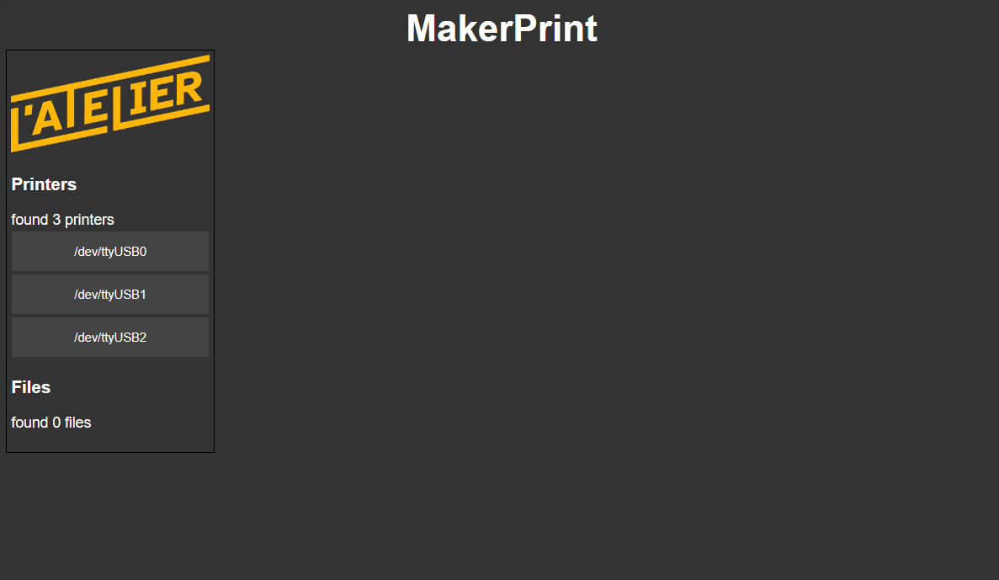

# maker-print

3D printer tool to manage and automate a bunch of 3d printers from a single server

## Dev Installation

install dev dependancies

'''bash
virtualenv venv
pip install -e .[dev]
'''

## Run the server

'''bash
cd makerprint
flask run
'''

make sure to change the settings in `makerprint/makerprint.env` to match your setup (logs location, gcode files locations, and so on).

## Run the tests

'''bash
pytest
'''

## Overview
This is an early version of the UÏ, it is not yet functional.
