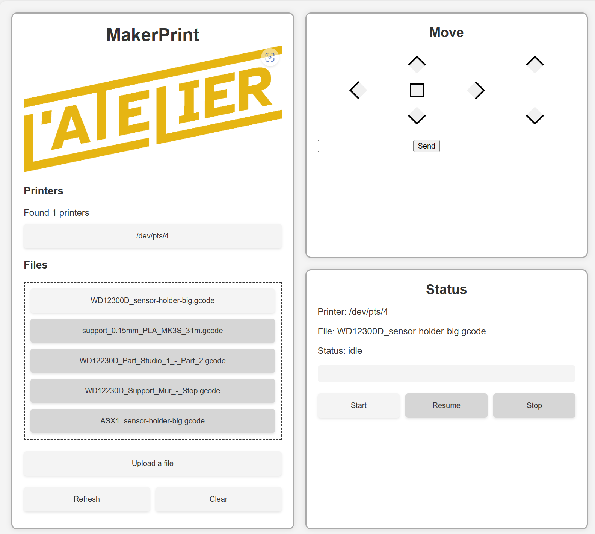

# maker-print


3D printer tool to manage and automate a bunch of 3d printers from a single device

## Dev Installation

run everything with docker-compose

```bash
docker-compose up --build
```

change the `docker-compose.yml` file to match your setup (ports, volumes, etc.)

## Frontend

```
Also make sure to change the `REACT_APP_API_URL` to match your setup.

### start the app

```bash
cd makerprint-app
npm install
npm run start # or npm run build to build the app
```

Here is an overview of the app:


## Deploy


### Login to docker registry

create a [personnal access token](https://github.com/settings/tokens) with:
- write:packages
- read:packages
- delete:packages
- repo

```bash
echo $CR_PAT | docker login ghcr.io -u USERNAME --password-stdin
```

### Build and push the images

```bash
docker-compose build
docker-compose push
```
